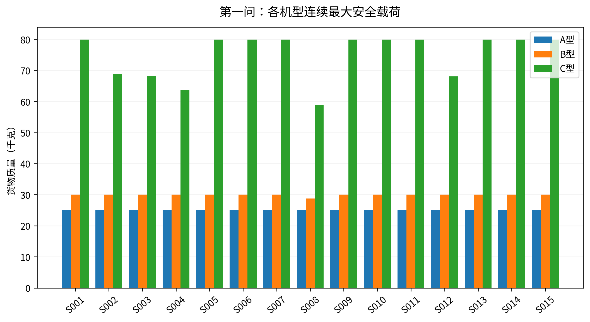

# 第一问：单点往返能力与整箱组批（修订版）

## 摘要与本版修订

在题面“问题一”限定的单点直接往返条件下，完成45组连续最大安全载荷与整箱可实现载荷计算；按架次数、能耗、累计作业时间的字典序，得到18架次、59.13129602 kWh、32776.015749累计作业秒，80箱全部恰好一次交付。该结论以第3节明示的能耗分项假设为条件。

本版正式敏感性下限不低于源参数；并列连续/整箱载荷，统一Q1与Q2的开始、交接与返回时间口径；所有报告结论由当次CSV/JSON生成。原模板表头不修改，最终工作簿强制逐格与物理复核，不能沿用未核对旧Excel。

## 1. 问题拆解与评价

题面第2页要求单服务区O01→Si→O01，不跨区合批，同区可多架次，货箱不可拆、每箱一次；题目没有要求在第一问安排实体无人机与共享电池。因此第一问不据机身数量限制同时架次，也不把Q2的硬时限和充电等待混入独立批次目标。

定义N为架次数，E为总运输能耗，T为所有架次累计作业时长。主目标采用lexmin(N,E,T)：先最少架次，同架次数下最小能耗，同能耗下最短累计作业。优先关系是本文公开选择，并非题面给定唯一权重。另解ENT、TNE、NTE及二维N—E完整前沿。

## 2. 数据与符号

输入来自清洗后的节点、机型、箱子和完整DEM。每箱b对应质量w_b、体积v_b与唯一目的地i；机型g对应Q_g、V_g、E_g、m_g及空/满载航程L0、LF。返航比例rho_g读取源表，不把它与实际返回SOC混淆。

| 参数 | A型 | B型 | C型 |
|---|---|---|---|
| 含电池空载质量/kg | 70.0 | 65.0 | 69.9 |
| 额定载货质量/kg | 25.0 | 30.0 | 80.0 |
| 容积/m³ | 0.06 | 0.073 | 0.25 |
| 可用电能/kWh | 4.5 | 4.0 | 8.0 |
| 空载标准航程/m | 25000.0 | 28000.0 | 26000.0 |
| 满载标准航程/m | 20000.0 | 16000.0 | 12000.0 |
| 巡航速度/(m/s) | 12.0 | 15.0 | 15.0 |
| 爬升速度/(m/s) | 3.0 | 3.0 | 2.5 |
| 下降速度/(m/s) | 2.5 | 2.5 | 2.0 |
| 固定准备/s | 300.0 | 300.0 | 300.0 |
| 逐箱装载/s | 30.0 | 30.0 | 30.0 |
| 每站基础交接/s | 150.0 | 150.0 | 180.0 |
| 逐箱交接/s | 30.0 | 30.0 | 36.0 |
| 返航余量比例 | 0.2 | 0.2 | 0.2 |

本问的N是架次数，不是实体架数；T是工时总和，不是多机并行Cmax。

## 3. 公共物理规则与明确假设

源题附录2：两节点水平直线航段；H_ij=max(所经过DEM像元)+50 m。O01作业高度为题定地面高程，服务区为题定地面高程+30 m；每次投送后重新爬升。主实现以经纬度短线段精确遍历触及像元（supercover），水平距离为WGS84椭球距离。不是用经纬度差当米，也不是稀疏抽样后漏掉山峰。主实现与独立all_touched扫描核对；源DEM分辨率仍是模型适用边界。

$$L_g(q)=L_g^0-(L_g^0-L_g^F)(q/Q_g)^{3/2}$$

$$t_{ijg}=h^{up}_{ij}/v_g^{up}+d_{ij}/v_g^{cr}+h^{down}_{ij}/v_g^{down}$$

题面只规定运输能耗由水平与爬升分项相加，未展开两个分项。因此明确补充：给定标准航程解释为用尽单组可用电能的对应水平航程；爬升效率解释为势能/电能比。含电池空载质量已经包含电池，不能重复加电池质量。

$$E^{hor}_{ijg}(q)=E_g^{use}d_{ij}/L_g(q)$$

$$E^{up}_{ijg}(q)=(m_g+q)g_0h^{up}_{ij}/(\eta_g\,3.6\times10^6)$$

上述是补充建模假设，不冒充官方唯一分项定义。源规则下降附加能耗为0，不另加能量回收。交接计时，但附件没有运输悬停功率，不虚构一项投送电耗；这不表示真实无人机悬停免费。若另有官方分项解释，应统一替换两问公共物理模型并全量重算。

## 4. 单点能耗、时间及最大安全载荷

去程载货q，到达Si完成该批全部交付，空载返回。两段爬升分别从O01作业高度、Si作业高度到各自巡航海拔计算，不能用净高差代替往返爬升。

$$E_{ig}(q)=E_{Oig}(q)+E_{iOg}(0),\quad E_{ig}(q)\leq(1-\rho_g)E_g^{use}$$

$$q^{safe}_{ig}=\max\{q:0\leq q\leq Q_g,\ E_{ig}(q)\leq(1-\rho_g)E_g^{use}\}$$

L(q)随q减小、1/L(q)随q增加，爬升项也增加，故E(q)单调增加。先检空载，不可行返回null；再检额定满载，满足则取Q_g；否则二分80次取可行侧。显示四舍五入不进入后续判定。

额定载荷只随机型；连续安全载荷还随航线、地形和余量变化；实际组批质量是离散箱重之和。连续定义不包含未知货物密度。针对本区现有箱集合，再枚举质量、体积、能耗均合格的子集，得到单架次整箱最大可实现质量。该值受库存限制，不能等同于机型物理能力，也不能把每个组合的见证箱重复当作全局交付方案。

| 区域 | A连续/kg | A整箱/kg | B连续/kg | B整箱/kg | C连续/kg | C整箱/kg |
|---|---|---|---|---|---|---|
| S001 | 25.000 | 22.000 | 30.000 | 28.000 | 80.000 | 80.000 |
| S002 | 25.000 | 22.000 | 30.000 | 28.000 | 68.860 | 67.000 |
| S003 | 25.000 | 22.000 | 30.000 | 28.000 | 68.206 | 67.000 |
| S004 | 25.000 | 22.000 | 30.000 | 28.000 | 63.697 | 59.000 |
| S005 | 25.000 | 22.000 | 30.000 | 28.000 | 80.000 | 59.000 |
| S006 | 25.000 | 22.000 | 30.000 | 28.000 | 80.000 | 59.000 |
| S007 | 25.000 | 22.000 | 30.000 | 28.000 | 80.000 | 45.000 |
| S008 | 25.000 | 22.000 | 28.801 | 28.000 | 58.904 | 45.000 |
| S009 | 25.000 | 22.000 | 30.000 | 25.000 | 80.000 | 25.000 |
| S010 | 25.000 | 22.000 | 30.000 | 25.000 | 80.000 | 25.000 |
| S011 | 25.000 | 22.000 | 30.000 | 25.000 | 80.000 | 25.000 |
| S012 | 25.000 | 22.000 | 30.000 | 25.000 | 68.117 | 25.000 |
| S013 | 25.000 | 22.000 | 30.000 | 25.000 | 80.000 | 25.000 |
| S014 | 25.000 | 22.000 | 30.000 | 25.000 | 80.000 | 25.000 |
| S015 | 25.000 | 22.000 | 30.000 | 25.000 | 80.000 | 25.000 |

受到能耗约束而低于额定质量的组合为：S002-C、S003-C、S004-C、S008-B、S008-C、S012-C。逐组合见证箱ID见payload_continuous_discrete.csv。

时间统一约定如下：架次开始=在O01固定准备开始；随后逐箱装载、飞行、逐站交接、返抵O01；模板“往返时间（s）”填写该架次返回时刻减开始时刻，与Q2语义对齐。原模板没有细化此列，本文明确采用这一解释，而不是声称题面排除了其他命名解释。

$$T_p=T_g^{prep}+n_pT_g^{load}+\sum t_{ijg}+T_g^{base}+n_pT_g^{box}$$

同时提供纯飞行19288.015749 s、飞行加交接24976.015749 s、完整累计作业32776.015749 s，文件time_components.csv可直接按明确的新口径转列，不需重新猜测。

## 5. 整箱集合划分与精确动态规划

对每区枚举全部物资数量向量及A/B/C机型；候选批次必须满足总质量≤Q_g、总体积≤V_g、往返能量≤(1−rho_g)E_g。没有箱体三维尺寸，只能采用总体积容量，不宣称求解三维几何装箱。

令x_p表示选择候选批次p，每箱只被覆盖一次。跨区批次在生成时即不允许。

$$\sum_{p:b\in p}x_p=1,\quad x_p\in\{0,1\}$$

第一问不区分同区同类同重同体积箱的时限，所以将其压缩为计数状态a。F(a)保存完成a所需最优(N,E,T)与前驱：

$$F(a)=\min_{u\leq a,\,u\ne0}^{lex}\{F(a-u)+(1,e_u,t_u)\}$$

F(0)=(0,0,0)，从小到大枚举全部状态/候选，无启发式截断。归纳地，最优解去掉最后一个批次必剩下更小状态的最优解；全部候选均被比较，故恢复的是声明字典序目标下的精确解（在浮点容差内）。各区独立、目标可加，局部最优相加即全局最优。计数方案恢复为真正箱号，第二套逐箱位掩码DP不使用计数压缩，独立复核各区最优值。

## 6. 主方案与最优性

| 架次 | 区域 | 机型 | 箱数 | 载荷/kg | 能耗/kWh | 作业/s |
|---|---|---|---|---|---|---|
| Q1-001 | S001 | C | 9 | 78 | 2.995769 | 1,692.169 |
| Q1-002 | S001 | C | 6 | 76 | 2.917582 | 1,494.169 |
| Q1-003 | S002 | B | 3 | 25 | 2.713422 | 1,816.694 |
| Q1-004 | S002 | C | 5 | 56 | 5.721225 | 2,041.812 |
| Q1-005 | S003 | B | 3 | 25 | 2.779917 | 2,080.523 |
| Q1-006 | S003 | C | 5 | 56 | 5.764965 | 2,370.091 |
| Q1-007 | S004 | C | 6 | 59 | 6.152932 | 2,301.057 |
| Q1-008 | S005 | C | 6 | 59 | 4.222193 | 1,877.191 |
| Q1-009 | S006 | C | 6 | 59 | 2.597988 | 1,561.554 |
| Q1-010 | S007 | C | 5 | 45 | 3.410894 | 1,907.566 |
| Q1-011 | S008 | C | 5 | 45 | 5.836012 | 2,199.701 |
| Q1-012 | S009 | B | 3 | 25 | 2.096234 | 1,558.442 |
| Q1-013 | S010 | B | 3 | 25 | 1.823196 | 1,555.380 |
| Q1-014 | S011 | B | 3 | 25 | 1.073952 | 1,188.420 |
| Q1-015 | S012 | B | 3 | 25 | 2.752414 | 1,922.740 |
| Q1-016 | S013 | B | 3 | 25 | 1.824759 | 1,510.472 |
| Q1-017 | S014 | B | 3 | 25 | 2.140388 | 1,869.756 |
| Q1-018 | S015 | B | 3 | 25 | 2.307453 | 1,828.277 |

总计18架次，机型构成{"C": 9, "B": 9}，能耗59.13129602 kWh，累计作业32776.015749 s；最低返航SOC=23.088350%。完整箱号见Q1_单点组批.csv及batches_NET.csv，每箱唯一归属见box_assignment.csv。

每个有需求服务区至少一架次；需求超过所有机型额定最大质量的区域至少再增加架次。对本数据，按每区ceil(需求质量/最大额定载荷)求和得下界18，主方案达到。因此架次数最少有“下界+可行解”证明；同架次下的能耗/时间通过完整DP及独立DP验证。该证明依赖所采用物理模型下的可行性，不跨越到未知替代能耗模型。

## 7. 多指标权衡与敏感性

| 优先关系 | 架次数 | 能耗/kWh | 累计作业/s |
|---|---|---|---|
| NET | 18 | 59.131296 | 32,776.016 |
| ENT | 19 | 59.033942 | 34,439.977 |
| TNE | 18 | 59.131296 | 32,776.016 |
| NTE | 18 | 59.131296 | 32,776.016 |

NET为架次→能耗→时间，ENT为能耗→架次→时间，TNE为时间→架次→能耗，NTE为架次→时间→能耗。不同优先关系不是误差。另在flight_energy_frontier.csv精确求各可行架次数的最低能耗，区分二维N—E前沿与完整三目标前沿；没有声称枚举后者。

| 返航下限 | 全箱可行 | 架次数 | 能耗/kWh | 累计作业/s |
|---|---|---|---|---|
| 20% | 是 | 18 | 59.131296 | 32,776.016 |
| 25% | 是 | 19 | 61.073387 | 34,565.659 |
| 30% | 是 | 20 | 67.227590 | 36,586.177 |
| 35% | 是 | 25 | 75.607590 | 45,383.564 |
| 40% | 否 | 不可行 | — | — |
| 45% | 否 | 不可行 | — | — |
| 50% | 否 | 不可行 | — | — |
| 55% | 否 | 不可行 | — | — |
| 60% | 否 | 不可行 | — | — |

正式实验全部不低于源表安全底线，每档重新优化而非只检验旧方案；不再把10%、15%放入正式结果。随余量提高，可用任务电量减少，连续安全质量不增，但整箱分割使架次数呈跳变。当前原方案可不变至最低返航SOC 23.088350%。

由于本问不限制实体/电池周转，只要每个单箱存在安全直接往返机型，就可逐箱完成；若单箱对所有机型都不可行，加入别箱只会增能耗。故共同余量极限为各箱“最佳单箱返航SOC”的最小值，当前为35.26780689%；逐箱证明见single_box_reserve_thresholds.csv。它是当前能耗模型下的可行性边界，不是可以降低题定底线的许可。

分项假设扰动（仅模型检验，不改源数据）如下：

| 水平乘子 | 爬升乘子 | 架次数 | 能耗/kWh | 最小SOC |
|---|---|---|---|---|
| 1.0 | 1.0 | 18 | 59.131296 | 23.0883% |
| 0.9 | 1.0 | 18 | 53.473740 | 30.5583% |
| 1.1 | 1.0 | 20 | 69.344199 | 21.0641% |
| 1.0 | 0.9 | 18 | 58.875722 | 23.3095% |
| 1.0 | 1.1 | 18 | 59.386870 | 22.8672% |

水平与爬升各±10%分别全量重算。完整方案及独立分项检查一起导出。节点表/DEM高程替代对照另见alternative_dem_node_elevation_summary.json，仅评估敏感性，不修改正式题定海拔。

## 8. 复核与向第二问继承

Q1独立验证1885项，失败0；另有见证载荷、能耗扰动和最终工作簿重新计算。继承给Q2的是箱子、地形、机型、能耗和时间函数，不是强行固定第一问组批。Q2将引入实际资源、硬时限、充电与多点访问，最优目标也改变，因此可能采用更多小型机架次并更快完成全部任务。

