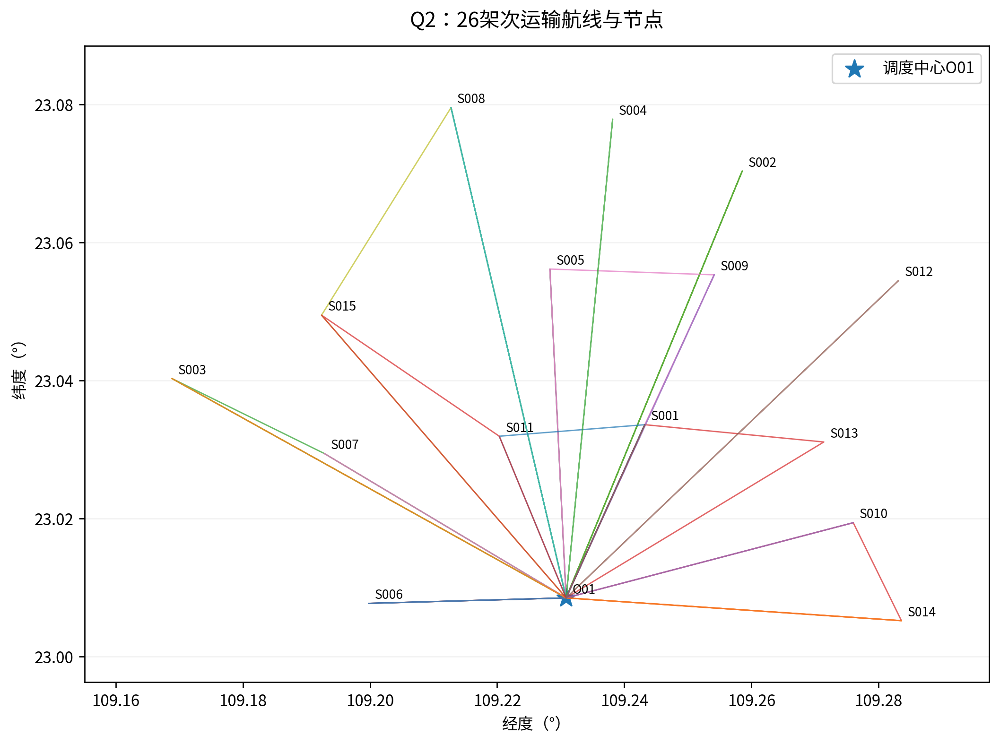
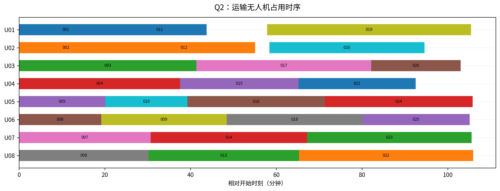
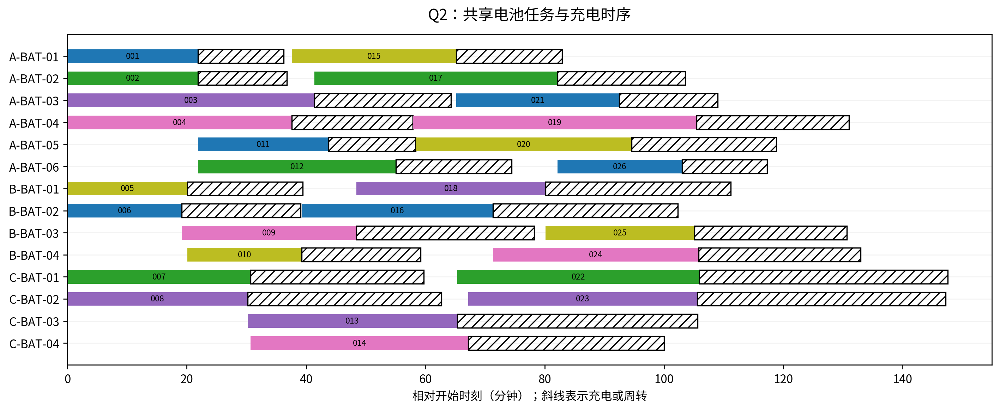
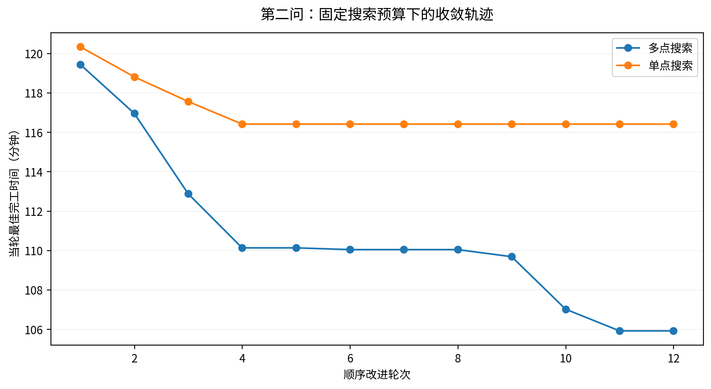
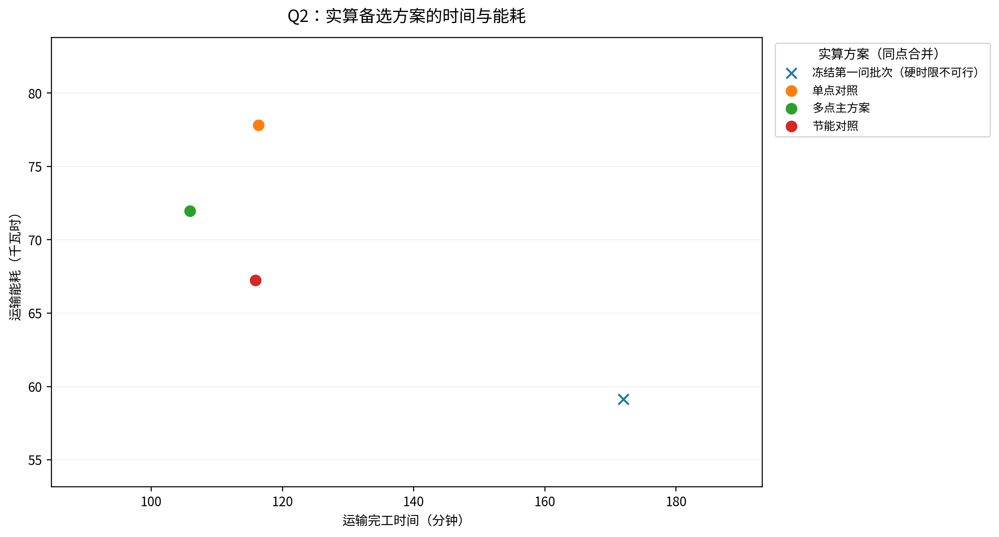

# 第二问：异构无人机多点多架次运输调度

## 摘要

继承第一问清洗数据与公共物理规则，重新联合优化真实货箱分配、访问次序、机型、实体无人机、共享电池和开始时刻。采用确定种子的箱级邻域搜索、模拟退火、破坏—修复和资源列表调度，得到26架次方案，7架次跨多个服务区、单架次最多3个服务区。全部80箱交付，医疗16/16、首批30/30均按硬时限完成；全部期望时间按期80/80。

最后一架无人机返回O01的时刻为6355.094259 s（105.918238 min），运输能耗71.94566215 kWh。已独立验证可行；零逾期达到该非负目标的理论下界，但Cmax、能耗和架次数没有全局最优证明。本报告不把启发式上界冒充严格全局最优。

## 1. 题意与第一问的继承边界

题面第3页要求不考虑通信保障，每次O01出发、访问一个或多个服务区后返回，满足全部箱约束、机身与电池库存、两阶段充电周转及物资时限。医疗expected_s和首批first_deadline_s是硬约束，普通物资expected_s用于及时性评价。Cmax是最后返航时刻，不是最后交付时刻，也不是所有架次工时之和。第三问的通信条件本问不加入，不能据本问结果宣称全程通信已经满足。

第一问给出了独立批次能力，但不包含排程。这里继承数据、单位、直接航段与能耗函数，重新允许跨服务区合批、拆分旧批、改变机型和箱号归属。对照中只固定Q1批次并使用相同资源列表调度，检验其直接继承效果；该对照不可行也不能证明所有其他固定组批排程都不可行。

## 2. 输入、资源、时钟及附加约定

场景包含15服务区、80货箱和8实体运输机。库存按源表读取：

| 机型 | 实体数量 | 共享电池总数 | 完全充电/s |
|---|---|---|---|
| A | 4 | 6 | 1800.0 |
| B | 2 | 4 | 2400.0 |
| C | 2 | 4 | 3000.0 |

共享电池数量已经包括初始机载与备用电池，不能再按机身数量加初装电池。源表没有每个电池的名称，因此按机型与序号生成唯一battery_id；它们可跨同型无人机使用，不能跨型。所有电池t=0满电。

统一s_p=固定准备开始；起飞=s_p+prepare+n×load；返回f_p=s_p+完整作业时长。机身与所选电池从准备开始独占到返航；准备和装载资源工位数未给定，因此不虚构全场单工位。题面没有额外运输换电/周转秒数，不重复加入任意常数。电池返航后立即充电，各组可并行，不假定有限充电端口。

到站后的交接采用源机型基础交接时间加逐箱交接时间，箱的交付完成是该箱交接完成，不是刚到站。点内顺序按硬截止、期望时间、优先级降序、箱ID的公开规则；这是本算法固定策略，不宣称穷尽所有交接次序。各架次采用不重复服务点的基本路线，最多允许15个不同服务区，不人为截为两点或三点；“不重复”是搜索策略边界，不冒充题面禁止重复访问。

## 3. 任意航段、动态载荷与时间递推

对16节点全图计算120个无向地形剖面，形成240条有向航段。每条按触及的全部DEM像元最高值+50 m定巡航海拔；起终点作业高度和爬升、巡航、下降速度与第一问一致。在每个投送点重新从30 m作业高度爬升。全部240条航段都用另一套rasterio all_touched在原始DEM上独立核验，未用欧氏平面捷径替代地形。

某架次p的路径为O01,i1,…,ik,O01，初始载荷q_p为全部箱重。访问j后卸下本站全部箱，后续航段只携带尚未交付货物。

$$q_{p,\ell+1}=q_{p,\ell}-\sum_{b\in B_{p,\ell}}w_b,\quad q_{p,1}=\sum_{b\in B_p}w_b$$

$$e_p=\sum_{\ell}\left[ E_g^{use}d_\ell/L_g(q_{p,\ell})+(m_g+q_{p,\ell})g_0h_\ell^{up}/(\eta_g\,3.6\times10^6)\right]$$

源题等效航程的3/2次幂关系保持不变。能源分项仍为第一问明示的补充假设；去程最大载荷不能用于所有中间航段，返程必须空载。下降附加能耗按题规则取0。

对每一站，先加三阶段飞行时间，再加本站基础交接时间，然后逐箱增加对应机型每箱交接时间，记录c_b；全部完成后开始下一条航段。当前模型的δ_pb=c_b−s_p由箱分配、机型、服务次序与点内次序唯一决定，可预计算。legs.csv列出每航段进出载荷、最高地形、三阶段时间及能耗分项；phase_events.csv列出完整事件边界。

## 4. 约束与优化模型

### 4.1 整箱与路径物理可行性

概念上令p为一个物理可行的整箱路线候选，x_p∈{0,1}表示选用；每个候选已指定机型、箱集合、服务顺序、能耗e_p、时长τ_p和逐箱偏移δ_pb。全部箱集合划分为互不重叠批次，且访问区集合恰好等于箱目的地集合。

$$\sum_{p:b\in B_p}x_p=1$$

$$\sum_{b\in B_p}w_b\leq Q_g,\quad\sum_{b\in B_p}v_b\leq V_g,\quad e_p\leq(1-\rho_g)E_g^{use}$$

质量/体积在起飞时最大；每站只卸货，使以后不增加。每条腿仍逐项验算实际剩余载荷。容量与箱不可拆同时满足，不能把758 kg平均摊到架次后假定可行。

### 4.2 医疗、首批与普通物资时限

对箱b，硬截止d_b^H取其所有适用硬时限的最小值；没有硬时限取无穷。医疗且首批的箱子同时满足两项，不能只取较宽松者。所选候选包含b时，c_b=s_p+δ_pb。硬约束c_b≤d_b^H；逾期量z_b=max(0,c_b−expected_b)。优先级π_b直接用附件值。

$$D=\sum_b \pi_b\max(0,c_b-d_b^{exp})$$

D统计所有箱；医疗/首批已在硬约束下，不会用其他物资早点送来抵消医疗迟到。数学模型禁止硬违约；搜索中的罚项只帮助穿越暂时不可行邻域，最终输出前必须硬违约为0。

### 4.3 实体机与共享电池

每个选中候选指派且只指派一架相同机型实体无人机与一组相同机型共享电池。同一无人机的区间[s_p,f_p)互不重叠；不同机型ID不能替换。可以同时使用不同无人机，不把累计工时当Cmax。

返航SOC r_p=1−e_p/E_g。依源题两阶段充电：

$$t_{ch}(r)=T_g^{full}\left[0.65\max(0,0.9-r)/0.9+0.35(1-\max(0.9,r))/0.1\right]$$

r<0.9时先快速补到0.9，再慢充到1；r≥0.9仅慢充剩余部分。r=0、0.9、1分别对应全充时间、0.35倍和0，在0.9处连续。不得用(1−r)×全充时间替代。电池任务占用与充电合起来为[s_p,f_p+t_ch(r_p))；同一电池的下一架次准备不能早于充满。不同电池可并行充电。

### 4.4 多目标优先关系

硬约束先满足；主目标为lexmin(D,Cmax,E,N)，其中Cmax=max_p f_p。本文选择优先清除逾期，再压缩完成时间，再省能量和架次。能耗和架次参与评价与同Cmax的选择，而不是用任意总和掩盖取舍。搜索打分用于接受候选，保存最优解时仍按字典序比较。

在D=0达到下界之后，另做Cmax≤1.10×主方案Cmax的能耗优先对照。它公开允许较长完成时间，不与主目标混称同一种最优。

## 5. 算法与一键流程

不枚举80箱的全部跨区子集。先预计算240航段及各型飞行时间；按箱的硬/期望截止与优先级构建初始解，将箱插入既有路线或新架次，枚举新增服务点所有插入位置；三种机型都进入候选。

解的编码为架次列表，每个元素为“机型、有序不同服务区、实际箱索引”。解码逐项选择最早空闲的相容机身和最早满电电池，开始=max(二者可用时刻)。任务返回后更新机身时刻与电池充满时刻。不同机型之间的列表交换不必产生实际差异；同型顺序、组批及型号选择共同改变资源冲突与时限。

邻域覆盖同型架次调序、单箱迁移、箱交换、整站块迁移、访问序交换、换型、分批、合批与新增单箱架次。物理不合格候选即时剔除。模拟退火容许部分目标劣化，避免只贪心；每轮再破坏2—9个箱并逐箱修复，保存最佳可行解。点内次序与列表式资源解码限制了搜索空间，因此没有Cmax/E/N全局最优保证。

主搜索固定种子[20260923, 20260924, 20260925]，各16,000次邻域与60次破坏修复；随后12轮、每轮100,000次邻域和220次修复。直接往返对照采用同样预算，仅限制每架次一个服务区。能耗对照另用4轮、每轮60,000次及150次修复。停止依据是固定迭代，不是硬件相关秒数；参数均在q2_config.py，物理参数在config.py或源数据。

物理评价按“机型、路线、箱集合”缓存；每次列表解码线性扫架次和箱，资源选择只需扫描该型小规模机身/电池。最坏组合优化仍困难，这里利用80箱、8机身的小场景做充分可复现多起点搜索。所有种子与每轮指标、初解/改进记录导出，不只保留最佳一次却不说明尝试预算。

流程：raw→全量清洗→Q1精确组批与独立验证→240航段→Q2初解/改进→3个对照→LP下界→逐箱/资源独立验证→原模板Excel→从最终Excel再重算→图表与中文报告。任一验收失败主程序报错，不能发布“通过”状态。

## 6. 最终架次、逐箱交付与资源结果

| 架次 | 无人机/型 | 电池 | 服务区顺序 | 开始/s | 返回/s | 能耗/kWh |
|---|---|---|---|---|---|---|
| Q2-001 | U01/A | A-BAT-01 | S001 | 0.000 | 1,310.900 | 1.2643 |
| Q2-002 | U02/A | A-BAT-02 | S006 | 0.000 | 1,313.478 | 1.3570 |
| Q2-003 | U03/A | A-BAT-03 | S007→S003 | 0.000 | 2,482.161 | 3.0248 |
| Q2-004 | U04/A | A-BAT-04 | S010→S014 | 0.000 | 2,255.329 | 2.4814 |
| Q2-005 | U05/B | B-BAT-01 | S006 | 0.000 | 1,207.271 | 1.1382 |
| Q2-006 | U06/B | B-BAT-02 | S001 | 0.000 | 1,149.100 | 1.2204 |
| Q2-007 | U07/C | C-BAT-01 | S007 | 0.000 | 1,841.566 | 3.3558 |
| Q2-008 | U08/C | C-BAT-02 | S005 | 0.000 | 1,811.191 | 4.1275 |
| Q2-009 | U06/B | B-BAT-03 | S002 | 1,149.100 | 2,905.795 | 2.5891 |
| Q2-010 | U05/B | B-BAT-04 | S001 | 1,207.271 | 2,356.371 | 1.2204 |
| Q2-011 | U01/A | A-BAT-05 | S006 | 1,310.900 | 2,624.378 | 1.3116 |
| Q2-012 | U02/A | A-BAT-06 | S014 | 1,313.478 | 3,303.888 | 2.2910 |
| Q2-013 | U08/C | C-BAT-03 | S002 | 1,811.191 | 3,919.003 | 5.8531 |
| Q2-014 | U07/C | C-BAT-04 | S001→S013 | 1,841.566 | 4,032.182 | 4.1848 |
| Q2-015 | U04/A | A-BAT-01 | S010 | 2,255.329 | 3,910.192 | 1.9549 |
| Q2-016 | U05/B | B-BAT-02 | S012 | 2,356.371 | 4,279.112 | 2.7524 |
| Q2-017 | U03/A | A-BAT-02 | S001→S009→S005 | 2,482.161 | 4,929.481 | 2.7144 |
| Q2-018 | U06/B | B-BAT-01 | S008 | 2,905.795 | 4,807.626 | 2.7634 |
| Q2-019 | U01/A | A-BAT-04 | S015→S008 | 3,472.171 | 6,327.124 | 3.5814 |
| Q2-020 | U02/A | A-BAT-05 | S008 | 3,503.275 | 5,674.407 | 3.3084 |
| Q2-021 | U04/A | A-BAT-03 | S011→S001 | 3,910.192 | 5,550.275 | 1.6957 |
| Q2-022 | U08/C | C-BAT-01 | S003 | 3,919.003 | 6,355.094 | 6.1495 |
| Q2-023 | U07/C | C-BAT-02 | S004 | 4,032.182 | 6,333.239 | 6.1529 |
| Q2-024 | U05/B | B-BAT-04 | S011→S015 | 4,279.112 | 6,348.189 | 2.2200 |
| Q2-025 | U06/B | B-BAT-03 | S009 | 4,807.626 | 6,306.068 | 2.0002 |
| Q2-026 | U03/A | A-BAT-06 | S001 | 4,929.481 | 6,180.380 | 1.2331 |

26架次使用机型构成为{"A": 12, "B": 8, "C": 6}；14组库存电池实际使用，充满后复用12次，其中10组在不同同型机身间共享。全部758.0 kg、2.011 m³、80箱交付，模板逐箱表有完整箱ID与完成秒数，不需人工从路线猜测分配。

最后交付时刻为5838.436810 s，最后返航时刻为6355.094259 s；二者不相同。总纯飞行29913.596322 s，总作业48027.596322 s，也均不是并行Cmax。末次电池充满可晚于Cmax，因为题定任务完成取运输机最后返航，不要求最后所有电池充满才算完工。

| 无人机 | 型 | 架次 | 作业/s | 最后返回/s | 利用率 |
|---|---|---|---|---|---|
| U01 | A | 3 | 5,479.33 | 6,327.12 | 86.22% |
| U02 | A | 3 | 5,475.02 | 5,674.41 | 86.15% |
| U03 | A | 3 | 6,180.38 | 6,180.38 | 97.25% |
| U04 | A | 3 | 5,550.27 | 5,550.27 | 87.34% |
| U05 | B | 4 | 6,348.19 | 6,348.19 | 99.89% |
| U06 | B | 4 | 6,306.07 | 6,306.07 | 99.23% |
| U07 | C | 3 | 6,333.24 | 6,333.24 | 99.66% |
| U08 | C | 3 | 6,355.09 | 6,355.09 | 100.00% |

| 电池 | 使用次数 | 执行无人机 | 末次充满/s |
|---|---|---|---|
| A-BAT-01 | 2 | U01 / U04 | 4,974.93 |
| A-BAT-02 | 2 | U02 / U03 | 6,213.63 |
| A-BAT-03 | 2 | U03 / U04 | 6,540.15 |
| A-BAT-04 | 2 | U01 / U04 | 7,861.75 |
| A-BAT-05 | 2 | U01 / U02 | 7,130.18 |
| A-BAT-06 | 2 | U02 / U03 | 7,036.59 |
| B-BAT-01 | 2 | U05 / U06 | 6,671.78 |
| B-BAT-02 | 2 | U05 / U06 | 6,138.49 |
| B-BAT-03 | 2 | U06 | 7,839.50 |
| B-BAT-04 | 2 | U05 | 7,976.88 |
| C-BAT-01 | 2 | U07 / U08 | 8,853.91 |
| C-BAT-02 | 2 | U07 / U08 | 8,832.99 |
| C-BAT-03 | 1 | U08 | 6,337.54 |
| C-BAT-04 | 1 | U07 | 5,998.89 |

最低返航SOC为20.413343%（Q2-019），源下限为20%。最紧硬时限为S012-MED-01，裕度仅2.328362 s。当前数学参数下可行，但时间和电量缓冲较小，不可把数值可行性说成真实扰动下的稳健保证。

## 7. 对照、权衡与下界

| 情景 | 硬时限可行 | 架次 | Cmax/s | 能耗/kWh | 按期箱数 |
|---|---|---|---|---|---|
| q1_frozen | 否 | 18 | 10,320.569 | 59.131296 | 67 |
| direct_only | 是 | 31 | 6,984.694 | 77.805377 | 80 |
| main | 是 | 26 | 6,355.094 | 71.945662 | 80 |
| energy_tradeoff | 是 | 23 | 6,954.141 | 67.227458 | 80 |

q1_frozen是将Q1批次按截止优先列表投入实际库存的诊断。它在该排程下违反硬时限，故不作为可提交第二问方案，也不拿其低能耗宣称优于满足时限的方案。固定组批是否还存在别的可行排程，本对照未证明。

与同预算直接往返重新优化对照相比，主方案Cmax下降9.0140%，能耗下降7.5312%，架次下降16.1290%。这是本次求得解之间的比较，不是两种问题全局最优值之差。

能耗优先对照在允许Cmax上限6990.603685 s内，得到23架次、67.22745793 kWh、6954.140854 s；较主方案能耗下降6.5580%，完成时间增加9.4262%。这说明及时性达标后仍有时长与能耗/架次权衡。

为不把“搜索未改进”当最优证明，构建保守工作量LP松弛。每箱可分数分配到各机型，架次和到访次数允许连续；保留每型总重量/体积容量，每服务区至少一次合计到访，各型累计工作量≤该型机身数×Cmax。每服务区的入航段时间取全图最小值，每次返航也取最短值；放松电池、时限和能量，故可行域包含原问题的投影。

单型工作量下界为：每架次固定准备与最短返航；每箱装载与交接；每次到站基础交接与最短入段。各项都不大于真实总作业，LP最优值因此是原问题的保守Cmax下界。SciPy linprog/HiGHS实际求解289变量、162不等式、80等式；原对偶证书最大残差1.08e-12，保守扣除数值容差后下界3222.353893 s。

当前可行上界6355.094259 s与下界的相对差为49.2949%。它反映下界较松和最优性尚未闭合，不等于实际误差，也不支持“接近全局最优”的断言。D=0有理论最优依据；其余目标仍为已核验启发式结果。

## 8. 独立验证与扰动边界

不复用优化器物理函数，从最终箱ID、路线、开始时间与原始DEM独立重算：逐箱唯一覆盖、单箱目的地、质量体积、各航段载荷、空载返航、能耗、每箱交接完成、全部硬时限、逐机区间、逐电池任务/充电区间与满电复用。主CSV检查1002项，失败0；有向地形检查240条，失败0。最大能量差4.44e-16 kWh，最大时间差1.82e-12 s，为浮点舍入量级。

三个对照另执行2777项资源/物理复核；冻结Q1对照允许记录硬违约，不将其标为硬可行。最终工作簿还经过独立复算，避免只验证内存解而导出文件错列。测试包含故意改错能耗、返航、箱号、机型电池、双重占用、交接完成与硬时限，确认验证器会拒绝错误答案。

冻结主方案整体延后的诊断如下；仅展示缓冲，不是放宽硬约束，也不是鲁棒重优化：

| 整体延后/s | 硬约束违约箱 | 期望时间违约箱 |
|---|---|---|
| 0 | 0 | 0 |
| 5 | 1 | 0 |
| 30 | 1 | 0 |
| 60 | 2 | 1 |
| 120 | 4 | 3 |

真实风场、测绘误差、未给出的功率过程和作业波动未被本题参数覆盖。本结果可用于题目规定的确定性模型与结果提交，不可直接作实际救援调度安全保证。需要更大缓冲时应显式修改硬截止裕度/能源储备并重新优化，不能只把输出小数取整冒充加了余量。

## 9. 文件与使用说明

最终submission/结果提交.xlsx的Q2_运输架次和Q2_逐箱交付可直接对应模板。箱表80行、架次表26行。细化文件trips.csv、box_deliveries.csv、legs.csv、phase_events.csv、drone_usage.csv、battery_cycles.csv、battery_usage.csv相互使用同一trip_id/box_id，不需要人工拼表。独立检查与下界证书、全部实验和参数均附于results/q2。

公共规则来源：用户题面“问题二”（第3页）、附录2（第7—9页）；全部设备、时限、箱属性来源于5个原基础工作簿。算法的资源列表规则、点内交接顺序、能耗分项闭合、字典序、启发式预算是本文明确选择。LP接口参照SciPy官方linprog文档，见docs/参考与参数说明.md，不从外部报道推导本场景参数。
