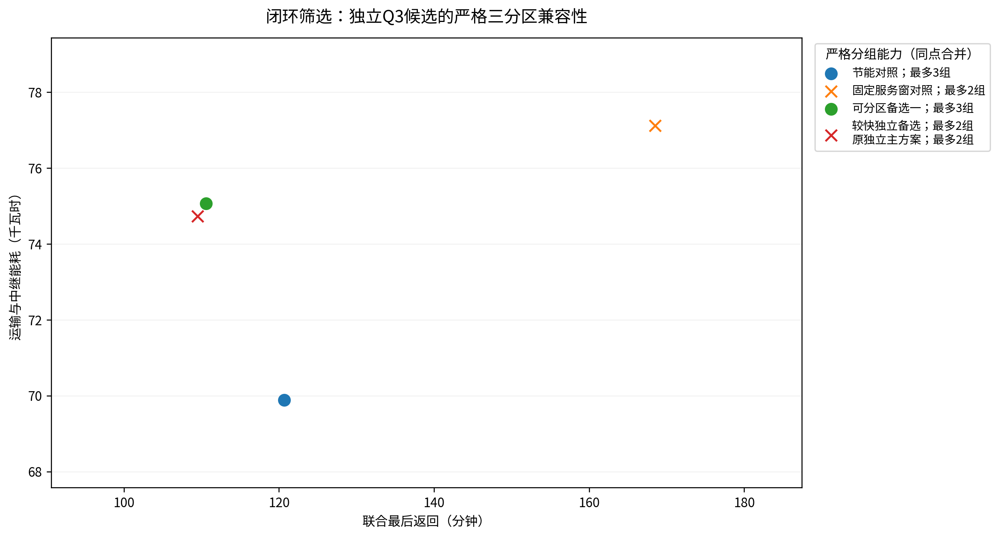

# 四问闭环验证与实质修订说明

## 1. 结论先行

本次闭环验证从题面、原始表格、清洗数据、公共物理、求解模型、CSV、最终Excel、报告及图件逐层反向核验。发现的主要问题不是Q1或Q2数值算错，而是旧Q4三组配置依赖复制Q3中继任务，不能作为“中继任务安排保持不变”的严格解释下主答案。

现已在Q3定稿阶段选择满足严格三组可分区的实算候选，并完整独立验证；之后Q4严格冻结该Q3，不复制、不拆分、不缩短、不重新安排任何运输或中继任务。资源不足按类型报告增补。旧的较快Q3只保留为独立优化对照，不再用作Q4的正式输入。

## 2. 修订前后及实际代价

| 指标 | 旧独立Q3 | 最终闭环Q3 |
|---|---|---|
| 运输架次 | 26 | 25 |
| 中继架次 | 4 | 4 |
| 联合最后返回/s | 6570.184296 | 6636.184296 |
| 运输与中继能耗/kWh | 74.728177 | 75.068888 |
| 严格依赖图不可拆单元 | 2 | 3 |

完工时间代价为66.000000秒，能耗代价为0.340710千瓦时。不是“加入限制后得到全局更优”，而是在已找到的可行方案中加入下游可分区性筛选。最终候选为polish_1；5个备选经严格图检查，其中2个支持至少三个非空独立组，再按及时性、联合完工、能耗和架次数择优。候选集未覆盖所有联合排程，不能声称四问全局最优。

曾另外试验延后单架次并增加专属中继的修复族，但最终发布不采用该高代价方法。源码保留作为候选不足时的明确后备；默认原数据运行选择现有可行备选，不产生第五次中继。

## 3. 数值与序列化问题

新Excel导出使用openpyxl，主流程每次从本轮CSV重建工作簿，不复制旧快照。发现默认16有效位浮点序列化可能轻微移动通信边界：数值显示很接近，但边界遮挡判断可不同。本次改为双精度往返可恢复的repr文本写入，并从真实XLSX单元格重新构造轨迹核验；没有放宽能耗、时限或通信判断容差。Excel显示6位小数只是显示规则，不是模型精度。

源坐标仍完全按附件存储，不能靠“四舍五入统一坐标”解决边界错误。主模板的六张表及Q3配套两张表保持原定义与编号引用；严格区分Q2-T和Q3-T命名空间。

## 4. 闭环验收层次

| 层次 | 实际检查量 | 失败数 | 对象 |
|---|---|---|---|
| 原单元格及公式 | 1467 | 0 | 原始业务表与题面数学对象 |
| 全量数据质量 | 5065 | 0 | 缺失、类型、逻辑、地理与全量DEM |
| Q1独立验证 | 1885 | 0 | 逐箱DP、能耗、时间、安全载荷 |
| Q2独立验证 | 978 | 0 | 多点运输、硬时限、机身和电池 |
| Q3独立验证 | 17290 | 0 | 运输、中继、全连续区间和边界 |
| Q4独立验证 | 11364 | 0 | 严格依赖图、全部划分、最少资源 |
| Q4物理继承 | 69158 | 0 | 主方案与均衡对照的实际任务重算 |
| 单元及错误注入 | 78 | 0 | 错误答案应被拒绝而非静默修正 |

检查次数是程序断言数量，不是统计样本量、正确率置信区间或外部认证。独立程序能验证题定模型中的数学和实现一致性，不能消除DEM分辨率、未给出的飞行功率或天气不确定性。两份最终Excel还需由validate_submission.py只读重验；发布前执行ZIP CRC和逐文件SHA-256核查。

## 5. 保留的前两问

Q1仍为18架次、59.131296千瓦时、32776.015749累计作业秒；Q2仍为25架次、71.727380千瓦时、6256.803746秒最后运输返回。第一问没有实体/电池调度、第二问没有通信限制，均符合各问前提。不能将Q2通信直连失败当成Q2违规，也不能把Q1累计工时当多机完工时间。

Q1三种时间分别保存在time_components.csv；安全载荷区分连续质量边界和现有整箱可实现值。正式余量敏感性从20%起，源物理值不改。以下共同模型与各问详述都使用同一套单位、对象ID和物理约束。

## 6. 题意逐项追溯

完整35行来源—要求—实现—边界矩阵为results/closure/requirement_traceability.csv。它是内容核对索引，不伪装成35项独立物理测试。对未由原文唯一确定的分项能耗、时间字段、坐标近似和逐箱交接顺序单独列为建模假设，不隐去。
