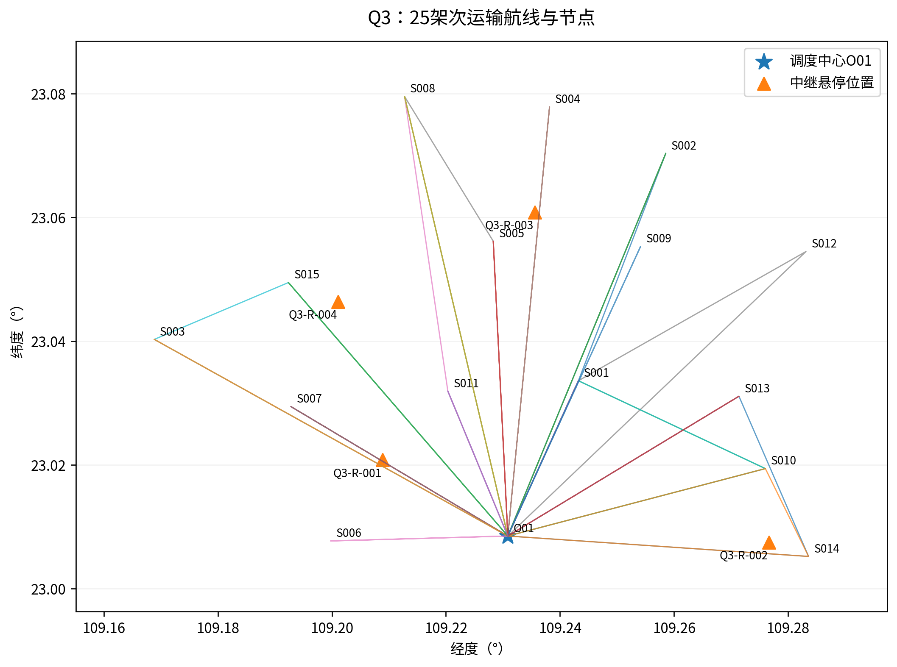
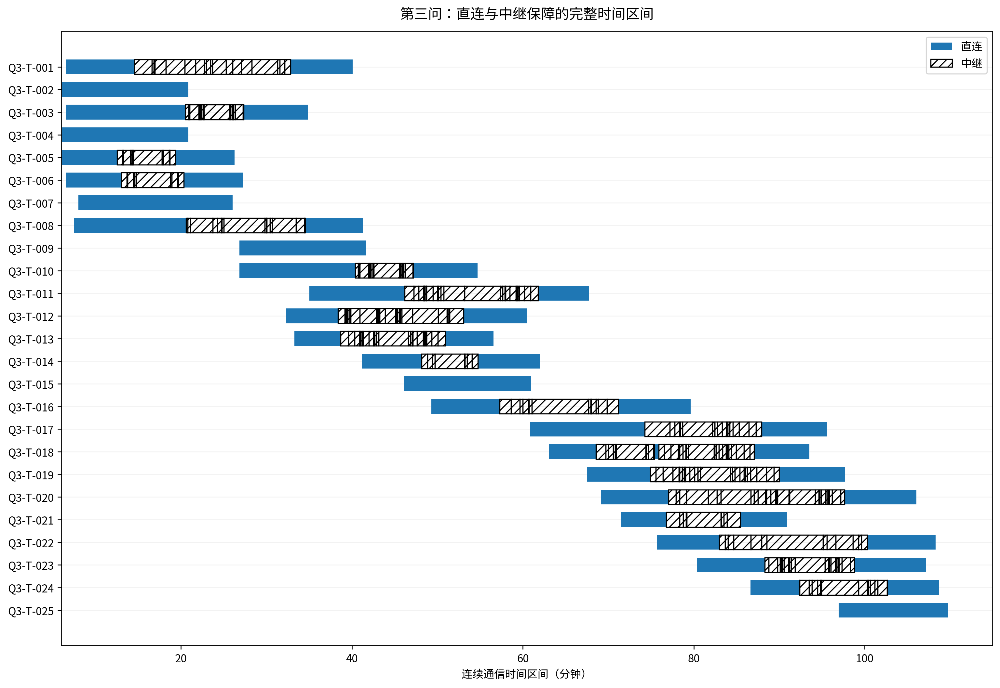

# 第三问：连续通信约束下的联合调度与下游可分区选解

## 1. 问题输入和目标

输入为清洗后的16节点、80不可拆货箱、三型8运输机和共享电池、DEM、2中继机、6能源组件与双向链路参数。运输每阶段（包括交接）必须连续可通信，不能只查服务点。联合完工为最后运输机和中继机返回O01的最晚时刻。

首先满足货箱、硬时限、载荷/体积、返航能量、机身/能源库存、充电及连续通信。联合目标按配送及时性D、联合完工、总能耗、两类架次字典序处理。D为源优先级加权的期望逾期量，医疗和首批另设硬约束。本数据D=0，达到非负下界；并不因此证明其他目标全局最优。

$$D=\sum_b\pi_b\max(0,C_b-d_b),\qquad C_{joint}=\max\{\max_r t_r^T,\max_j t_j^R\}.$$

最终选解时，先要求运输—中继依赖图至少有3个连通分量，再在实际验证的候选中比较上述目标。这是为满足第四问严格任务冻结而增加的透明选择准则，不是说题目第三问单独强制这项约束。

## 2. 双向无线预算

$$P_{th,b}=S_b+M_b,\quad L_{max,a\to b}=P_{t,a}+G_a+G_b-L_{sys}-P_{th,b}.$$

$$L_{max,ab}=\min\{L_{max,a\to b},L_{max,b\to a}\}.$$

| 链路 | 正向上限/dB | 反向上限/dB | 双向上限/dB |
|---|---|---|---|
| 直连 | 122.0 | 129.0 | 122.0 |
| 中继接入 | 116.0 | 116.0 | 116.0 |
| 中继回传 | 126.0 | 134.0 | 126.0 |

题定频率2400MHz，遮挡附加损耗10dB，路径损耗：

$$L_{ab}(t)=32.45+20\log_{10}(2400)+20\log_{10}(d_{ab}(t)/1000)+10B_{ab}(t).$$

d输入m，除1000为km。源模型常数32.45不能改为习惯的32.44。直连可用优先选直连；否则存在一架服务中的中继，接入和回传同一时刻均可用才为中继状态。每架运输机同刻只能有一个保障者，不进行中继多跳。未提供用户容量上限，不能擅自将中继限制为一次只服务一架运输机。

## 3. 连续通信判定算法

一个飞行或交接阶段的位置为仿射轨迹P(s)=P0+s(P1−P0)。连接固定锚点A与全段轨迹得到视线三角扇面：

$$X(u,v)=A+u(P_0-A)+v(P_1-A),\quad u\geq0,\ v\geq0,\ u+v\leq1.$$

对扇面经过的各DEM像元叠加平面边界及视线高度不高于地形的约束，得到凸多边形；参数s=v/(u+v)投影的顶点极值给出完整遮挡区间。汇总像元区间求并集。每个固定遮挡状态段内，距离平方为s的二次函数，解门限根，再合并阶段端点、中继建链/结束时刻和阴影边界，形成状态不变的开区间。所有孤立边界点另用静态视线检查。

独立验证不调用主裁剪函数，而是用半平面边界两两交点枚举多边形，再以独立AW格网遍历复核单点；完整区间与边界合在一起支撑连续覆盖。稠密时间/空间样本只作实现交叉检查，不能替代连续性证明。

最终共有1017个正长度区间、1042个孤立边界点。模板的零时长行用“·边界点”标识；它们表示真实瞬时约束，不是缺失或重复任务。公开采用开区间加唯一端点状态的表示，避免共享边界双重指派。

## 4. 中继航程、服务与能源

悬停点须在有效DEM内，离地不超300.0m。计划总起飞质量23.5kg已包含能源及通信载荷。中继可用能量3.2kWh，返航余量20%；准备180.0秒、建链30.0秒、机身周转300.0秒。往返净空沿用每条弧段最高地形+50m规则。

水平能耗由巡航功率与巡航时间确定，爬升由势能/效率模型确定。驻留从到达悬停点起计悬停和通信功率，包括建链过程；只有建链完成后才计通信服务可用。服务结束后返回，不把航途中的中继当已建链服务者。

$$E_j^R=P_{cr}(t_{out,cr}+t_{in,cr})/3600+E_{up,out}+E_{up,in}+(P_{hov}+P_{com})(b_j-t_{arr,j})/3600.$$

每个中继机身任务区间延长到返回+周转；能源组件延长到返回+充电至100%。二者分别排程；不同资源可同时充电。全部任务在源库存内完成，不调用Q4后来假设增补的库存。

## 5. 求解技术路线与停止规则

第一层在完整有效DEM以4像元步长扫描121317个平面候选，用回传预算和运输候选采样点筛选。候选高度取沿途规则巡航海拔和地形+最大AGL中的较低值，额外剔除低于50.0m的候选；它是公开的有限搜索子域，不能说覆盖了所有连续高度。

第二层采用2架中继各前后2次任务的结构，联合邻域搜索货箱移动、换型、站序、合并/拆分及破坏修复。每个候选运输架次通过连续几何求可开始时间窗，在机身和满电电池可用后安排；不是只给Q2成品路线添加通信标签。所有随机种子和预算集中q2_config.py、q3_config.py，固定迭代而非超时截断。

第三层固定运输路线、位置和中继实体顺序，用MILP选择通信原子的唯一提供者及中继起止，先最小联合完工，再在最优容差内最小中继能耗。输出阶段状态、间隙和约束残差，只是该固定子问题证书。

第四层外层改进保存全部已求得可行备选。在Q3定稿前计算每个备选的运输与中继依赖连通分量，至少3个才可进入闭环主方案选择。当前候选polish_1被选中，未改它的具体物理任务。最终再次独立核验，从最终Excel回读核验后才冻结给Q4。

| 实算候选 | 严格分量数 | 支持三组 | 联合返回/s | 总能耗/kWh |
|---|---|---|---|---|
| energy_tradeoff | 3 | 是 | 7241.381500 | 69.890616 |
| fixed_service_windows | 2 | 否 | 10111.579473 | 77.121824 |
| polish_1 | 3 | 是 | 6636.184296 | 75.068888 |
| polish_2 | 2 | 否 | 6570.184296 | 74.728177 |
| uncoupled_baseline | 2 | 否 | 6570.184296 | 74.728177 |

该有限候选筛选不是全局联合最优证明。旧更快的独立Q3不支持严格三组，不能一方面沿用它的时间/能耗，一方面在Q4偷偷使用另一组中继任务。

## 6. 最终结果

| 指标 | 最终值 |
|---|---|
| 运输架次 | 25 |
| 中继架次 | 4 |
| 机型架次 | {'A': 12, 'B': 7, 'C': 6} |
| 多服务区架次 | 9 |
| 运输能耗/kWh | 71.746798 |
| 中继能耗/kWh | 3.322089 |
| 总能耗/kWh | 75.068888 |
| 最后箱交付/s | 6303.675967 |
| 最后运输返回/s | 6585.699536 |
| 最后联合返回/s | 6636.184296 |
| 最低运输返航SOC/% | 23.088350 |
| 最低中继返航SOC/% | 55.837641 |

| 运输架次 | 机型/实体 | 访问顺序 | 准备开始/s | 返航/s | 能耗/kWh |
|---|---|---|---|---|---|
| Q3-T-001 | A/U01 | S014;S013 | 0.000 | 2405.279 | 2.71581 |
| Q3-T-002 | A/U02 | S001 | 0.000 | 1250.900 | 1.28235 |
| Q3-T-003 | A/U03 | S001;S010 | 0.000 | 2091.777 | 2.31615 |
| Q3-T-004 | A/U04 | S001 | 0.000 | 1250.900 | 1.24032 |
| Q3-T-005 | B/U05 | S007 | 0.000 | 1576.275 | 1.65649 |
| Q3-T-006 | B/U06 | S007 | 0.000 | 1636.275 | 1.78002 |
| Q3-T-007 | C/U07 | S006 | 0.000 | 1561.554 | 2.59799 |
| Q3-T-008 | C/U08 | S001;S012 | 0.000 | 2476.888 | 5.27431 |
| Q3-T-009 | A/U02 | S001 | 1250.900 | 2501.799 | 1.28235 |
| Q3-T-010 | A/U04 | S001;S010 | 1250.900 | 3282.677 | 2.35831 |
| Q3-T-011 | C/U07 | S001;S002 | 1561.554 | 4061.996 | 6.10249 |
| Q3-T-012 | B/U05 | S010;S014 | 1576.275 | 3632.316 | 2.40157 |
| Q3-T-013 | B/U06 | S002 | 1636.275 | 3392.970 | 2.87015 |
| Q3-T-014 | A/U03 | S013 | 2109.216 | 3721.329 | 2.02545 |
| Q3-T-015 | A/U01 | S001 | 2405.279 | 3656.179 | 1.28235 |
| Q3-T-016 | C/U08 | S004 | 2476.888 | 4777.945 | 6.15293 |
| Q3-T-017 | A/U02 | S011;S008 | 3260.888 | 5737.106 | 3.13699 |
| Q3-T-018 | B/U06 | S005;S008 | 3392.970 | 5612.796 | 2.92062 |
| Q3-T-019 | A/U01 | S008 | 3689.847 | 5860.980 | 3.30843 |
| Q3-T-020 | A/U04 | S003;S015 | 3760.663 | 6363.995 | 3.29722 |
| Q3-T-021 | B/U05 | S009 | 3898.837 | 5457.279 | 2.09623 |
| Q3-T-022 | C/U07 | S003 | 4061.996 | 6498.088 | 6.14948 |
| Q3-T-023 | A/U03 | S015 | 4463.968 | 6432.557 | 2.55769 |
| Q3-T-024 | C/U08 | S005 | 4777.945 | 6523.136 | 3.91537 |
| Q3-T-025 | B/U05 | S011 | 5457.279 | 6585.700 | 1.02572 |

| 中继架次 | 实体/组件 | 经度 | 纬度 | 海拔/m | 离地/m |
|---|---|---|---|---|---|
| Q3-R-001 | R01/R-ENG-01 | 109.20888889 | 23.02083333 | 352.109 | 74.965 |
| Q3-R-002 | R02/R-ENG-02 | 109.27666667 | 23.00750000 | 587.281 | 50.000 |
| Q3-R-003 | R01/R-ENG-03 | 109.23555556 | 23.06083333 | 371.416 | 57.770 |
| Q3-R-004 | R02/R-ENG-04 | 109.20111111 | 23.04638889 | 625.316 | 122.104 |

| 中继架次 | 准备开始/s | 完成建链/s | 服务结束/s | 返回/s | 能耗/kWh |
|---|---|---|---|---|---|
| Q3-R-001 | 302.057 | 743.679 | 1226.978 | 1477.301 | 0.289 |
| Q3-R-002 | 225.702 | 863.806 | 3191.572 | 3657.974 | 0.961 |
| Q3-R-003 | 1795.194 | 2453.763 | 6167.306 | 6636.184 | 1.413 |
| Q3-R-004 | 4019.874 | 4699.985 | 5957.539 | 6469.118 | 0.659 |

显示小数不改变存储值。全部80箱恰好一次，医疗16/16、首批30/30按硬时限交付，所有80箱均不晚于期望时间。运输电池使用14组，满电复用11次；中继机身2架、能源组件4组，均在源库存内。

## 7. 可行性与最优性边界

独立检查17290项失败0，额外稠密检查52454点失败0。此结果支持源确定性场景与共同补充模型下的可行性；不支持天气、测绘或时钟任意变化下的无条件安全。条件MILP的最优性不推广到连续选址及全部货箱路径组合。Q3最终版本和Q4源哈希完全对齐；后续第四问只配置与划分，不改本节任务。
