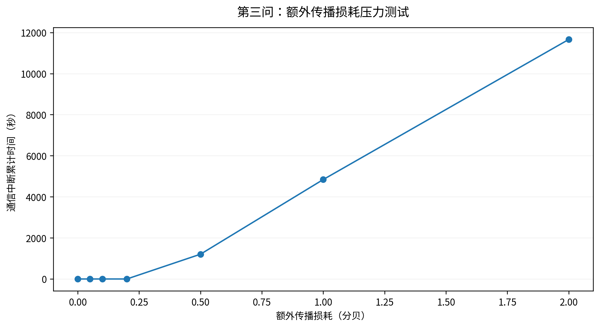
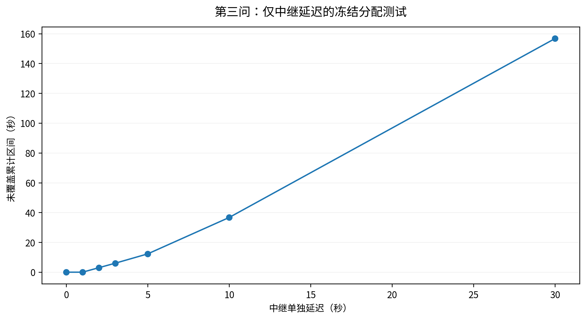
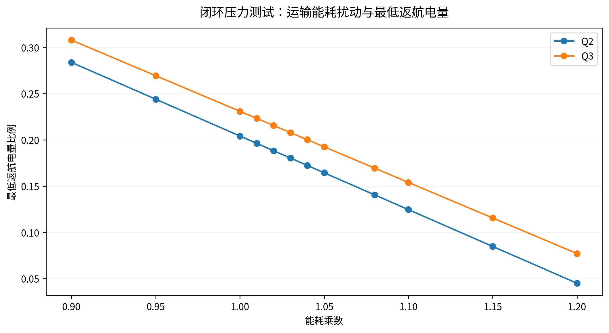
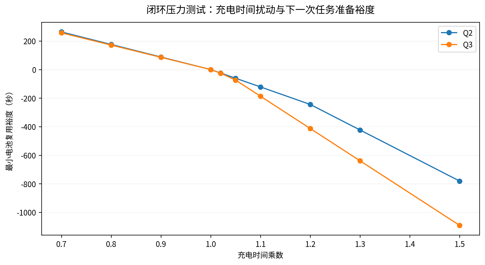
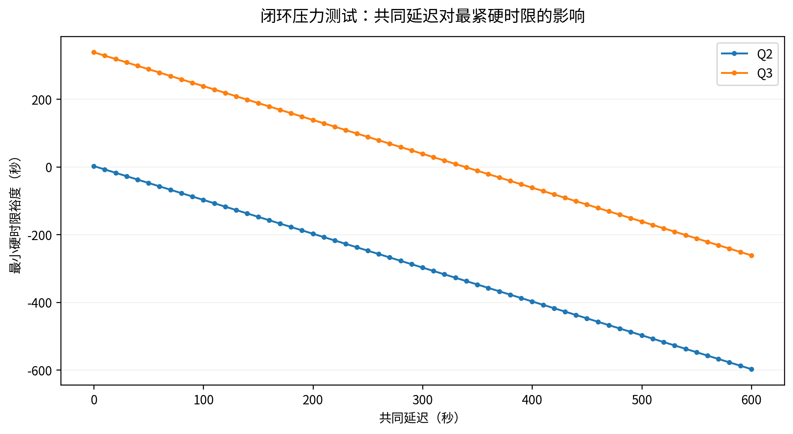

# 可靠性压力测试与失败情景

## 1. 不混淆三类实验

重优化实验指改变参数后重新求解，如Q1各档安全余量和能耗分项扰动；冻结排程压力测试只修改指定物理量并检查现有任务，不调路线/机身/开始时刻；纯诊断视图是对已求得结果按不同维度绘图，不构成新的优化试验。本包图件多，不能把每一张图称为一次独立随机实验。

## 2. Q3额外传播损耗

冻结运输及中继位置/时间，允许按题定直连优先规则在已部署单跳链路中重新选择。每个损耗档重解距离门限根并重建连续区间，不只是查原来中点。

| 额外损耗/dB | 累计断链/s | 断链边界点 | 连续可行 |
|---|---|---|---|
| 0.0 | 0.000000 | 0 | 是 |
| 0.05 | 0.000000 | 0 | 是 |
| 0.1 | 0.000000 | 0 | 是 |
| 0.2 | 0.000000 | 0 | 是 |
| 0.5 | 1206.973568 | 39 | 否 |
| 1.0 | 4840.962646 | 140 | 否 |
| 2.0 | 11658.119275 | 277 | 否 |

最大已测试通过值0.200000dB只说明该测试维度；不证明未测试区间或真实干扰分布的可靠率。0损耗基准应完全通过，否则不得提交。

## 3. 延迟情景不可互相替代

全部运输、中继、充电共同平移时相对通信和资源关系不变，硬截止固定。当前最紧硬时限裕度为338.499732秒；这是统一平移的边界，不是某架中继单独迟到的边界。仅中继晚到、原通信分配不变的结果如下：

| 中继单独延迟/s | 未覆盖累计区间/s | 未覆盖边界点 | 原分配可行 |
|---|---|---|---|
| 0.0 | 0.000000 | 0 | 是 |
| 1.0 | 0.000000 | 0 | 是 |
| 2.0 | 3.000000 | 1 | 否 |
| 3.0 | 6.000000 | 1 | 否 |
| 5.0 | 12.277397 | 1 | 否 |
| 10.0 | 36.694104 | 2 | 否 |
| 30.0 | 156.694104 | 6 | 否 |

不同运输机保障时间累加可大于日历时间，不把它误解为一个全局断网窗口。原分配失败也不自动证明允许重新选链路后仍失败；两种检验必须区别。

## 4. 运输能耗与充电速度压力测试

新增24组能耗倍率场景、20组充电时间倍率场景，均分别作用于Q2和最终Q3。能耗增加时重新计算返航SOC和同一电池从该SOC充满所需时间，再检查下一次任务能否开始。仅充电倍率试验不改变飞行能耗。二者均冻结任务与资源分配，不宣称是重优化后的最优方案。

新增122组共同延迟细网格场景，每问0至600秒、10秒一步，统计硬截止与普通期望逾期货箱数。失败点以违约数量和负裕度保存，不能删去后声称全场景可行。每个运输架次另给只针对SOC约束的能耗放大上界，不能代替含充电/通信的鲁棒上界。

## 5. 结果使用限制

Q2最紧硬裕度2.328362秒，明显比最终Q3小。不能将两个不同任务方案的这个差解释为通信本身提高鲁棒性的因果效应。Q3不同候选的目标与路线均可能变化，本项目只报告各自的可测裕度。无风速/随机作业时间的实测分布，不虚构蒙特卡洛可靠率、置信区间或大样本实验。

全部试验源表位于results/closure和results/q3。中文图中的扰动横轴是人为测试参数，不是原始附件观测；参考0/1倍基准与正式答案数值一致。
