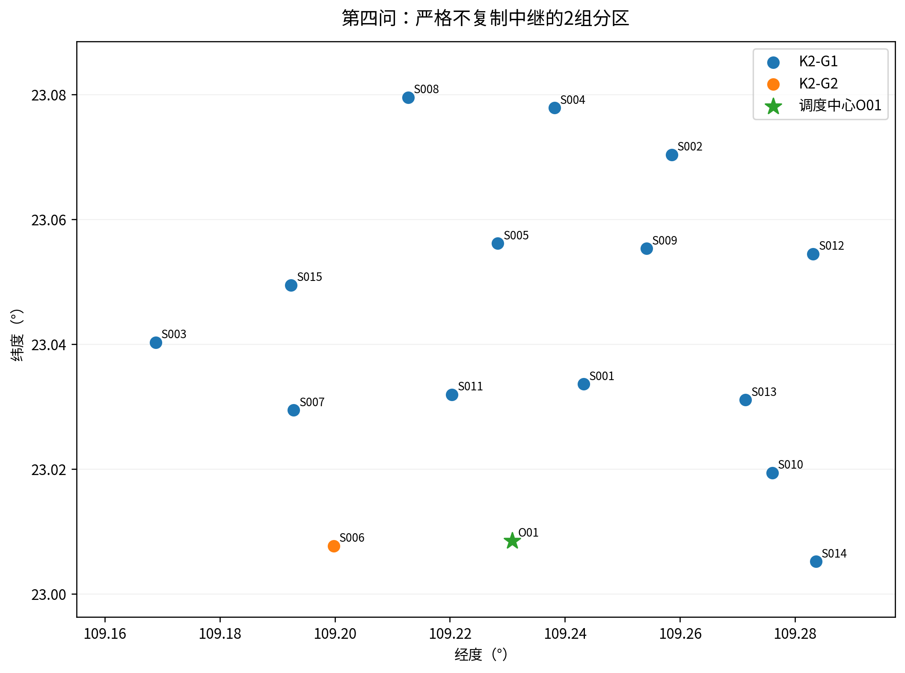
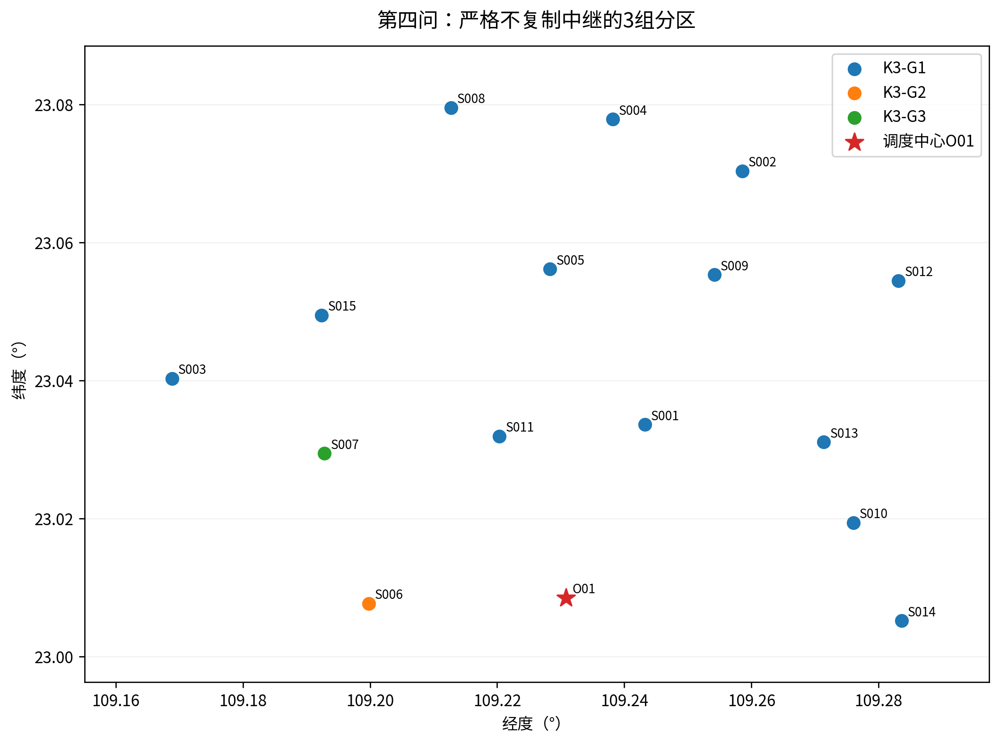

# 第四问：严格保持第三问任务的分区与资源配置

## 1. 输入冻结与原错误修复

本问输入为本版最终Q3：25运输架次、4中继架次及对应逐箱/通信表。源题要求货箱组批、访问次序、运输与中继任务安排和通信关系保持不变。因此不同组不能复制同一中继任务，也不能让一架中继在执行时同时属于两个组。

旧包三组主表采用额外中继副本解释，已退出正式答案。现在先在Q3选择可严格分为三组的实算候选，再冻结给Q4；Q4不靠更改原Q3凑出可行划分。两种分区的中继任务总数均恰好4，没有额外能耗或改变完工时间。

## 2. 不可拆分单元的构造与完整枚举

构建以服务区为顶点的图：同一运输架次访问的全部服务区加必须同组边；依赖同一个源中继任务的全部运输服务区也加必须同组边。连通分量是不可拆分单元。任何合法组是这些单元的并；若拆开一个分量，必然违反运输同组或通信任务唯一所有权。

| 单元 | 服务区 | 箱数 | 运输架次 | 运输工作量占比 |
|---|---|---|---|---|
| C01 | S001;S002;S003;S004;S005;S008;S009;S010;S011;S012;S013;S014;S015 | 69 | 22 | 89.910385% |
| C02 | S006 | 6 | 1 | 3.300195% |
| C03 | S007 | 5 | 2 | 6.789420% |

共3个分量。采用限制增长串枚举无标签非空划分，K=2有3种，K=3有1种，共4种。独立程序用DFS重建图、另一套锚定集合递归枚举，核对集合完全相同。旧版只用运输依赖得到的364种不是严格通信冻结的合法空间，不能继续引用为最终候选数。

## 3. 最少资源配置的区间模型

运输机身占用[准备开始,返回)，运输电池占用到返回后充满；中继机身占用到返回+周转，中继能源占用到返回+充满。半开区间允许在资源恰好可用时开启下一任务，数值容差只吸收浮点舍入，不省略充电。固定时序、同型资源相同条件下，最少数量等于该类区间最大同时重叠数：

$$n_{g,r}=\max_t\sum_{a\in A_{g,r}}\mathbf{1}\{s_a\leq t<e_a^{ready}\}.$$

以开始时间排序、最早可用资源复用给出达到该下界的分配。独立验证用区间相容图最大匹配/最小路径覆盖核对最少数量，而不是只重算同一个贪心公式。每类输出峰值时刻及同时占用任务作下界见证。

资源执行开始前可按组重新指派同型实体；任务时刻、载荷、通信锚点不变。源实体ID的重新配置只是本问求独立需求的操作，不是执行过程中跨组借用。源库存从原表读取，任务执行时每个物理ID只能属于一个组。标识“@K3-G1”等仅表示源任务归属，不代表复制第二次任务。

## 4. 目标与比较量

优先最小分类型库存缺口总件数，再最小资源总件数，再最小运输累计作业量变异系数。各类型库存I_r，组需求n_gr：

$$G=\sum_r\max(0,\sum_g n_{g,r}-I_r),\quad R=\sum_{g,r}n_{g,r}.$$

$$CV=\frac{\sqrt{K^{-1}\sum_g(W_g-\overline{W})^2}}{\overline{W}}.$$

W是运输完整作业累计时间，不是组的最后返航时刻或组内服务区个数。资源件数是公开无量纲比较标准，不能解释为采购成本。剩余中继能源不能抵扣缺少的C型无人机。另给均衡优先对照与各型库存冗余。

## 5. 全部候选与主方案

| 候选 | 组数 | 资源件数 | 缺口件数 | 运输工作量CV |
|---|---|---|---|---|
| K2-112 | 2 | 33 | 5 | 0.864212 |
| K2-121 | 2 | 29 | 2 | 0.933996 |
| K2-122 | 2 | 35 | 7 | 0.798208 |
| K3-123 | 3 | 35 | 7 | 1.200941 |

| 分区 | 组 | 服务区 |
|---|---|---|
| 2组 | K2-G1 | S001;S002;S003;S004;S005;S007;S008;S009;S010;S011;S012;S013;S014;S015 |
| 2组 | K2-G2 | S006 |
| 3组 | K3-G1 | S001;S002;S003;S004;S005;S008;S009;S010;S011;S012;S013;S014;S015 |
| 3组 | K3-G2 | S006 |
| 3组 | K3-G3 | S007 |

| 资源类别 | 原库存 | 两组需求 | 三组需求 | 两组缺口 | 三组缺口 |
|---|---|---|---|---|---|
| A型运输无人机 | 4 | 4 | 4 | 0 | 0 |
| B型运输无人机 | 2 | 2 | 4 | 0 | 2 |
| C型运输无人机 | 2 | 3 | 3 | 1 | 1 |
| A型电池组 | 6 | 6 | 6 | 0 | 0 |
| B型电池组 | 4 | 4 | 6 | 0 | 2 |
| C型电池组 | 4 | 5 | 5 | 1 | 1 |
| 中继无人机 | 2 | 2 | 3 | 0 | 1 |
| 中继能源组件 | 6 | 3 | 4 | 0 | 0 |

两组总需29件、缺口2件；三组总需35件、缺口7件。全部严格候选中原库存可行数：两组0、三组0。这不影响本问报告“所需独立配置”，但必须说明要增补后才可执行，不能将配置需求说成现库存已够。

两组与三组总运输/中继能耗均为75.068888kWh，联合完工均为6636.184296s，来自严格任务继承而非新的优化测量。分区改变资源在组间的可复用性，不改变固定任务执行时间。因此设备变多不应在本模型下自动使任务变快。

## 6. 均衡与冗余的含义

最大不可拆单元占运输工作量89.910385%，限制了任何合法均衡。资源优先两组CV为0.933996，三组为1.200941；不能因为任务组较多就说均衡必然改善。三组只有一种严格划分，均衡优先与资源优先重合不是搜索不足，而是合法空间只有一个元素。

未分区时按固定时序重新优化能源编号可少用中继组件，源Q3使用了4个ID，而区间下界是3组。因此要区分原方案实际使用ID数、同一时序最少配置数、独立分组导致的增量和原库存冗余，不能把四个量混为一谈。

## 7. 独立验证

Q4独立图与枚举、逐资源最少数量、源任务映射和主表共11364项检查，失败0。主方案和均衡对照另做69158项运输、中继、时限及连续通信核验，失败0。从最终工作簿回读数量并关联详细本地资源表，验证实际提交而非内存字典。

精确最优性只相对于本版冻结的Q3、同型资源可在执行前配置的规则及目标顺序。没有证明原题全部可能Q3方案中本分区最省资源，也不使用额外库存倒灌修正Q3可行性。
